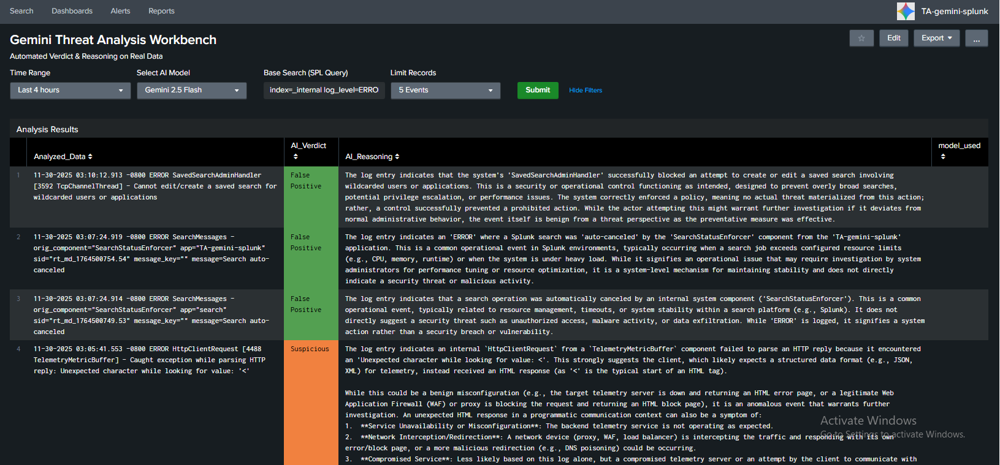
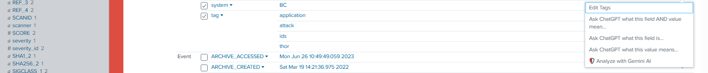
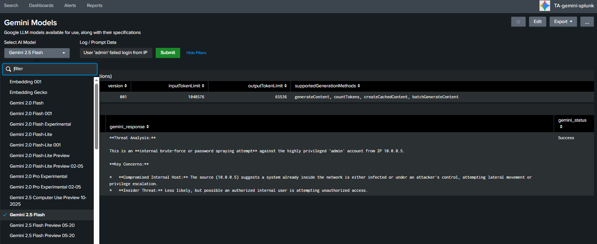
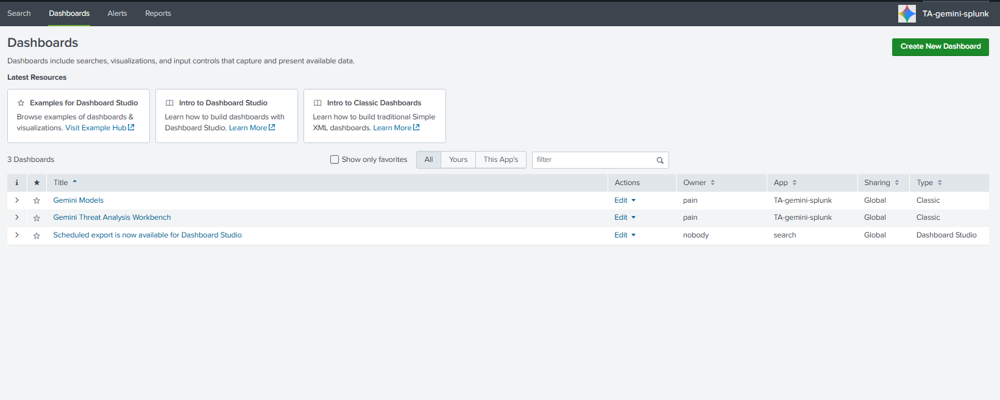

# 🛡️ Gemini Threat Hunter for Splunk

[](https://opensource.org/licenses/MIT)
[](https://www.splunk.com/)
[](https://deepmind.google/technologies/gemini/)

**Gemini Threat Hunter** is a comprehensive Splunk App designed to operationalize Generative AI in your SOC. By integrating **Google Gemini 2.5 Flash/Pro**, it automates the analysis of raw logs, providing clear verdicts (True/False Positive) and detailed reasoning, helping analysts triage alerts faster.

---

## 📸 Visual Tour

### 1. The Threat Analysis Workbench
The core of the app. This dashboard takes raw logs and processes them through Gemini AI.
*   **Color-Coded Verdicts:** Instantly spot `True Positives` (Red) and `False Positives` (Green).
*   **AI Reasoning:** Read *why* the AI made that decision in the reasoning column.
*   **Raw Data Context:** Compare the AI's output directly with the original log data.



### 2. Seamless Workflow Integration
Analyze logs directly from your investigation flow. No need to copy-paste logs into external tools.
*   **Context Menu:** Right-click on any event field in the Search & Reporting app.
*   **One-Click Action:** Select `🛡️ Analyze with Gemini AI` to send the specific log to the workbench.



### 3. Model Specifications Dashboard
Stay updated with available models.
*   **Dynamic Lookup:** View detailed specs (Token Limits, Supported Methods) for all available Gemini models.
*   **Model Selection:** Helps you choose the right model (Flash for speed, Pro for complexity) for your analysis.



### 4. App Navigation
Easily access different components of the app through the standard Splunk interface.



---

## 🚀 Key Features

*   **⚡ Automated Triage:** Reduces alert fatigue by automatically classifying events using LLMs.
*   **🧠 Explainable AI:** Doesn't just give a score; provides a human-readable explanation for every verdict.
*   **🛡️ Proxy & Bypass Support:** Built-in configuration to route API requests through local HTTP/HTTPS proxies (essential for restricted networks).
*   **📊 Structured JSON Output:** The AI output is parsed into Splunk fields (`AI_Verdict`, `AI_Reasoning`) for easy reporting and dashboarding.
*   **💰 Cost & Speed Optimized:** Default configuration uses `Gemini 2.5 Flash`, offering a perfect balance of speed and low cost for log analysis.

---

## 🛠️ Installation

1.  **Download:** Clone this repository or download the ZIP file.
2.  **Install:** Copy the `TA-gemini-splunk` folder to your Splunk apps directory:
    *   Linux: `$SPLUNK_HOME/etc/apps/`
    *   Windows: `C:\Program Files\Splunk\etc\apps\`
3.  **Restart:** Restart your Splunk instance.

---

## ⚙️ Configuration

### 1. Set Google API Key (Required)
You need a Google AI Studio API Key. Get it for free [here](https://aistudio.google.com/).

Open `bin/gemini_command.py` and replace the placeholder:

```python
# bin/gemini_command.py

# Replace with your actual key
API_KEY = "YOUR_GOOGLE_API_KEY_HERE"

2. Configure Proxy (Optional)

If your Splunk server is behind a firewall, VPN, or in a region blocking Google services, configure the proxy settings in bin/gemini_command.py.
Note: The app supports passing Splunk traffic through local proxies like v2ray/Nekoray.

# Example for local proxy
PROXIES = {
    "http": "http://192.168.1.100:2080",
    "https": "http://192.168.1.100:2080",
}

# If direct connection is available, leave it empty:
# PROXIES = {}
📖 Usage Guide
Method A: Using the Workflow Action (Fastest)

Run a search in Splunk (e.g., index=ips alert_level=high).

Click the arrow next to an event or a field.

Select Event Actions > 🛡️ Analyze with Gemini AI.

The Workbench will open in a new tab with the analysis already in progress.

Method B: Using the Dashboard (Bulk/Manual)

Go to Apps > TA-gemini-splunk.

Open Gemini Threat Analysis Workbench.

Base Search: Enter a query to fetch logs (e.g., index=windows EventCode=4625 | head 10).

Select Model: Choose your preferred Gemini version.

Click Submit.

❓ Troubleshooting
Issue	Solution
Search is waiting for input...	Ensure you are using the latest version of the dashboard XML provided in this repo. The app uses default tokens to prevent this.
API Error (404/403)	Check your API Key. Also, verify that the selected_model exists in your region.
Connection Refused	Check your PROXIES setting in bin/gemini_command.py. Ensure the IP matches your host machine IP (not 127.0.0.1) if Splunk is running on a VM.
JSON Parse Error	Rarely, the AI might fail to return JSON. Try running the search again.
🤝 Contributing

Pull requests are welcome! If you want to add support for more models (Claude, GPT) or improve the dashboard visualizations:

Fork the repo.

Create a feature branch.

Submit a PR.

📄 License

This project is licensed under the MIT License.
